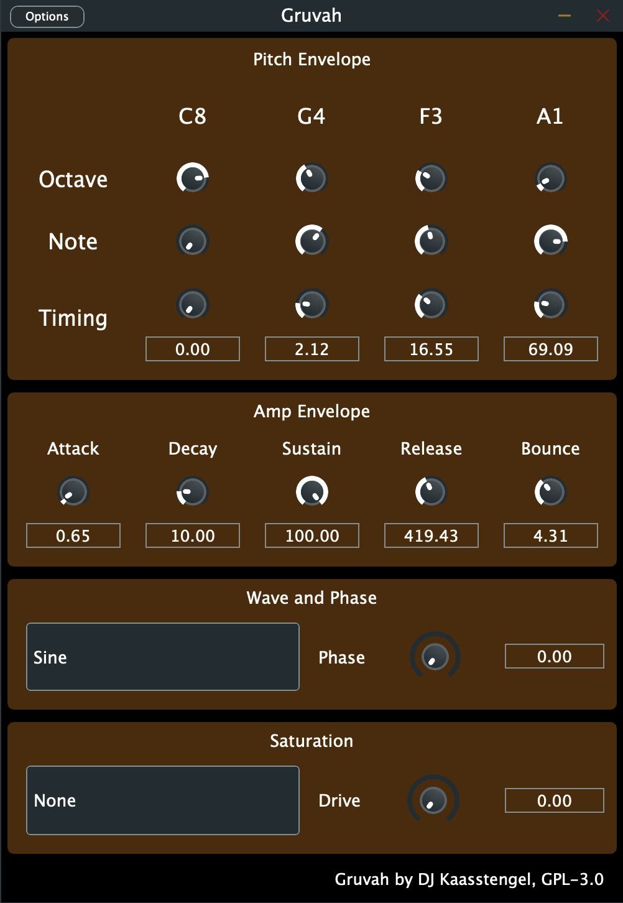
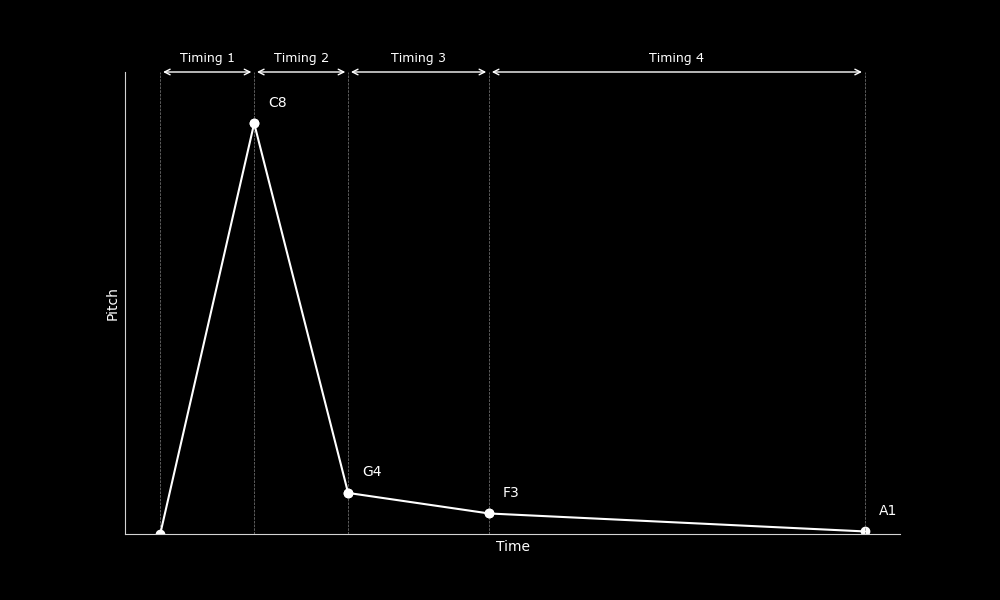
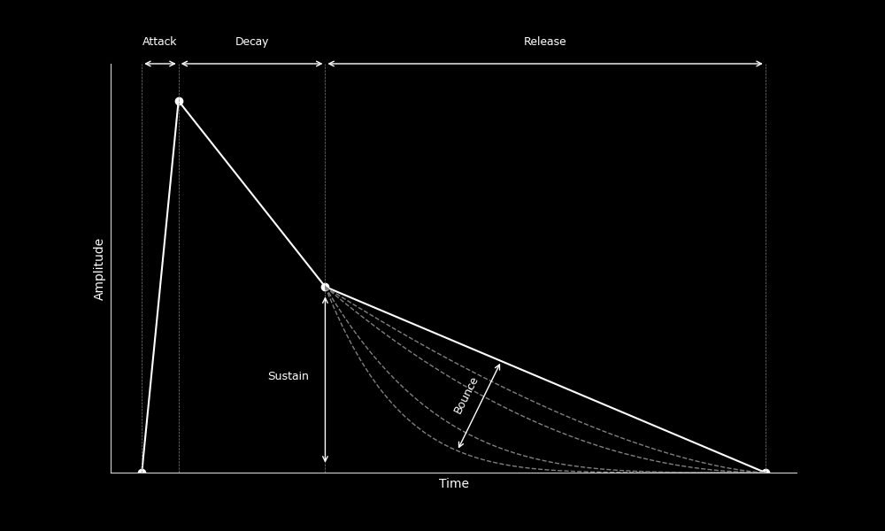

# Gruvah-rs

Gruvah is a cutting-edge open source kick synth plugin designed for EDM producers. It empowers you to create powerful and distinct kick drum sounds to elevate your tracks. With its versatile synthesis options, intuitive interface, and precise control over the specific kick shape. Gruvah allows you to shape your signature kicks with ease.

Gruvah is based on and forked from the rust plugin example [distortion-rs](https://github.com/jatinchowdhury18/distortion-rs)



## Usage

### Pitch Envelope
As shown in the image below the parameters in the pitch envelope control the frequency of the oscillator after any note is triggered.
The octave and note parameters control the midi pitch of the oscillator. The timing parameters specify the time it takes for the pitch to change from one value to another. 
For example, in this image the frequency of the oscillator will rise to the frequency of the note C8 in the time specified by timing 1. 
Subsequently, the frequency will fall to the frequency of the note G4 in the time specified by timing 2, as for the rest of the parameters.



### Amplitude Envelope
The amplitude envelope controls the amplitude of the oscillator after a note is triggered. 
The bounce parameter controls the amount of bounce in the amplitude envelope i.e. how curved the release envelope is.



### Wave and phase
The wave parameter controls the underlying wave of the oscillator. The phase parameter controls the starting phase of the oscillator, which is useful for tuning the kick to fit with your bass.


### Saturation
| Saturation Type | Description                                       |
|-----------------|---------------------------------------------------|
| None            | No saturation (drive does nothing)                |
| Soft            | Soft clipping (tanh clipping, similar to analog clipping)  |
| Clip            | Brickwall digital clipping (cuts off peaks)      |
| Extreme Clip    | Does the same as clip but the drive parameter is scaled to be more extreme |


## Building
To build the plugin, you must have Rust and CMake installed. You
also need [`cbindgen`](https://github.com/eqrion/cbindgen), which
can be installed with the command:
```bash
cargo install --force cbindgen
```

Next, clone the repository and initialize submodules:
```bash
git clone https://github.com/djosh34/Gruvah
cd gruvah-rs
git submodule update --init --recursive
```

Finally, build the project using CMake:
```
mkdir build
cd build
cmake ..
make -j[Number of threads]
```

If you want to automatically copy the plugin to your plugin directory, you add the following flag to the cmake command:
```
cmake .. -DJUCE_COPY_PLUGIN_AFTER_BUILD:BOOL=ON
```

## Contributing
For any gui changes to be made using foleys-gui-magic, you need to set the following flag in the CMakeLists.txt file:
```
FOLEYS_SHOW_GUI_EDITOR_PALLETTE=1
```


## License

This project is licensed under the GPL-3.0 license. See the [COPYING](COPYING.md) file for details.